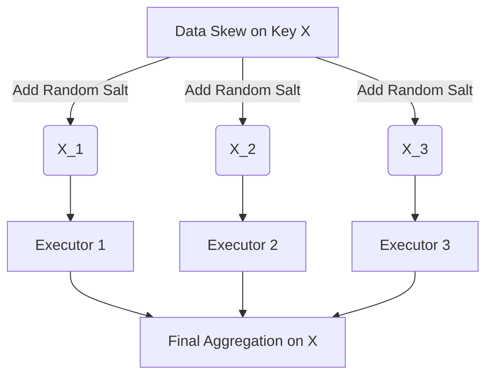

# MLOps & Data Engineering: The "Edge-Case" Interview Guide
**15 Highly Unconventional, Deep-Dive Questions for Senior Data/ML Engineers**

*This guide tests your understanding of distributed systems, streaming architectures, and the brutal realities of serving ML models in production.*

---

## 1. Streaming & Distributed Systems

<details>
<summary><b>Q1: In Apache Kafka, why does increasing the number of Partitions eventually degrade performance and crash the cluster?</b></summary>
<br>

**Answer:**
While more partitions allow more parallel consumers (higher throughput), each partition maps to an actual directory and file on the broker's disk. 
1. **Open File Handles:** A cluster with 100,000 partitions requires hundreds of thousands of open file handles.
2. **ZooKeeper Bottleneck:** When a broker crashes, ZooKeeper/KRaft must re-elect a new leader for *every single partition* that was on that broker. If there are 10,000 partitions, the election process takes so long that the cluster experiences massive downtime. 
*Rule of Thumb:* Keep partitions per broker under 2,000-4,000.
</details>

<details>
<summary><b>Q2: How does Apache Spark's "Shuffle" phase cause Out-Of-Memory (OOM) errors, and how do you fix it without adding more RAM?</b></summary>
<br>

**Answer:**
A Shuffle occurs during wide transformations (like `groupByKey` or `join`), where data must be redistributed across all executors over the network. 
If a single key has billions of records (Data Skew), all those records are sent to a *single* executor, instantly crashing it with an OOM error.
**Fix (Salting):** Add a random number (salt) to the skewed key before the shuffle (e.g., `key_1`, `key_2`). This forces Spark to distribute the skewed data evenly across multiple executors. After the initial aggregation, you remove the salt and do a final aggregation.


</details>

<details>
<summary><b>Q3: You are building a Real-Time feature store using Redis. Why might using `KEYS *` to find specific features crash your production application?</b></summary>
<br>

**Answer:**
Redis is strictly **single-threaded**. The `KEYS *` command blocks the main event loop until it scans every single key in the database. If you have 10 million keys, the database will freeze for seconds, causing all other microservices that depend on Redis (including your ML serving layer) to time out and crash. 
*Fix:* Always use the `SCAN` command, which iterates through keys incrementally without blocking the thread.
</details>

---

## 2. Model Serving & Kubernetes

<details>
<summary><b>Q4: What is the difference between Data Parallelism and Pipeline Parallelism when serving a massive LLM (like LLaMA-70B) in production?</b></summary>
<br>

**Answer:**
- **Data Parallelism (DP):** You place a full copy of the model on every GPU. If the model doesn't fit on one GPU, DP is impossible.
- **Pipeline Parallelism (PP):** You split the model vertically. Layers 1-20 go on GPU A, Layers 21-40 on GPU B. The forward pass travels through GPU A, then over the network to GPU B. 
**The trap:** In PP, GPU B sits completely idle while GPU A is working (the "Pipeline Bubble"). To fix this, you must split incoming requests into "micro-batches" so GPU A can start working on the next request while GPU B finishes the first.
</details>

<details>
<summary><b>Q5: You deployed an ML model to Kubernetes using an HPA (Horizontal Pod Autoscaler) based on CPU usage. Traffic spikes, but the pods don't scale up in time and the service goes down. Why?</b></summary>
<br>

**Answer:**
HPA relies on the Kubernetes Metrics Server, which by default scrapes metrics every 15-60 seconds. Furthermore, ML models (especially Python/TensorFlow) take 30-90 seconds just to load the model weights from disk into memory during startup (`Cold Start`). 
If a traffic spike occurs in 10 seconds, Kubernetes won't even notice for 30 seconds, and the new pods won't be ready to accept traffic for another minute. 
*Fix:* Use **KEDA** to autoscale based on the *length of the incoming message queue* (e.g., Kafka lag) rather than CPU, allowing Kubernetes to scale up *before* the CPU hits 100%.
</details>

<details>
<summary><b>Q6: What is the "Thundering Herd" problem in ML caching?</b></summary>
<br>

**Answer:**
If you cache expensive ML predictions (e.g., in Redis) with an exact TTL (Time-To-Live) of 60 minutes, the cache will expire exactly 60 minutes later. 
If this is a highly popular item, the moment the cache expires, 10,000 concurrent requests will miss the cache simultaneously and hit your heavy ML inference server at the exact same millisecond, crashing it. 
*Fix:* Add **Jitter** to the TTL (e.g., `60 minutes + random(0, 5) minutes`), or use a probabilistic early recomputation algorithm.
</details>

---

## 3. Data Pipelines & Orchestration (Airflow)

<details>
<summary><b>Q7: In Apache Airflow, why should you NEVER put heavy computation inside the global scope of a DAG file?</b></summary>
<br>

**Answer:**
The Airflow Scheduler parses every single Python DAG file in your folder every 30-60 seconds to detect changes. If you put a heavy Pandas transformation or a database query in the global scope (outside of an operator/task), that query will be executed *every 30 seconds* by the scheduler, quickly causing the scheduler to freeze and your database to crash.

```python
# ❌ TERRIBLE: Runs every 30 seconds globally
df = pd.read_sql("SELECT * FROM huge_table") 

def my_task():
    # ✅ CORRECT: Runs only when the task executes
    df = pd.read_sql("SELECT * FROM huge_table") 
```
</details>

<details>
<summary><b>Q8: What is Idempotency in Data Engineering, and why is it mandatory for ETL pipelines?</b></summary>
<br>

**Answer:**
An idempotent task produces the *exact same outcome* whether it is run once, or a thousand times. 
If your Airflow task is `INSERT INTO table SELECT * FROM raw_data`, and the task fails halfway through, running it again will create duplicate records. 
*Fix:* Use `UPSERT` (Insert on Conflict Update), or design the task to first `DELETE FROM table WHERE date = yesterday` before inserting the new data.
</details>

---

## 4. Production ML & Drift

<details>
<summary><b>Q9: What is the difference between Data Drift and Concept Drift?</b></summary>
<br>

**Answer:**
- **Data Drift (Covariate Shift):** The relationship between X and Y stays the same, but the distribution of X changes. (e.g., You trained a spam filter on English emails, but suddenly users start sending Spanish emails).
- **Concept Drift:** The distribution of X stays the same, but the *mathematical relationship* between X and Y changes. (e.g., A user's purchasing power hasn't changed, but inflation caused the definition of "Expensive" to change).
</details>

<details>
<summary><b>Q10: Why is calculating accuracy or AUC in real-time usually impossible in production ML systems?</b></summary>
<br>

**Answer:**
In a supervised learning environment, you instantly know the true label $y$. In production, you suffer from **Delayed Ground Truth**. 
If you predict that a user will default on a 30-year mortgage, you literally have to wait 30 years to get the true label to calculate your accuracy! 
*Fix:* In production, you monitor **Proxy Metrics** (e.g., prediction distributions) and calculate Population Stability Index (PSI) to ensure the model's outputs today look statistically similar to its outputs during training.
</details>
