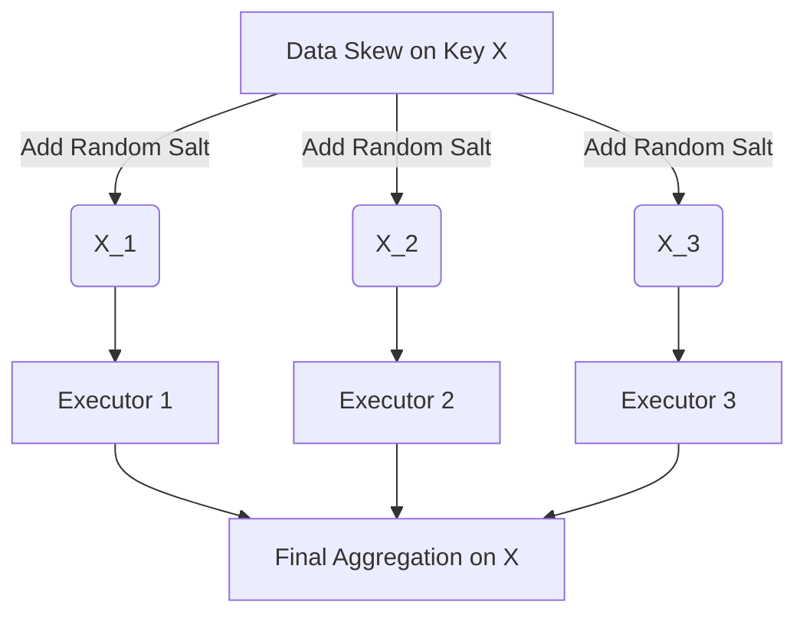

# MLOps & Data Engineering: The "Edge-Case" Interview Guide
**15 Highly Unconventional, Deep-Dive Questions for Senior Data/ML Engineers**

*This guide tests your understanding of distributed systems, streaming architectures, and the brutal realities of serving ML models in production.*

---

## 1. Streaming & Distributed Systems

<details>
<summary><b>Q1: In Apache Kafka, why does increasing the number of Partitions eventually degrade performance and crash the cluster?</b></summary>
<br>

**Answer:**
While more partitions allow more parallel consumers (higher throughput), each partition maps to an actual directory and file on the broker's disk. 
1. **Open File Handles:** A cluster with 100,000 partitions requires hundreds of thousands of open file handles.
2. **ZooKeeper Bottleneck:** When a broker crashes, ZooKeeper/KRaft must re-elect a new leader for *every single partition* that was on that broker. If there are 10,000 partitions, the election process takes so long that the cluster experiences massive downtime. 
*Rule of Thumb:* Keep partitions per broker under 2,000-4,000.
</details>

<details>
<summary><b>Q2: How does Apache Spark's "Shuffle" phase cause Out-Of-Memory (OOM) errors, and how do you fix it without adding more RAM?</b></summary>
<br>

**Answer:**
A Shuffle occurs during wide transformations (like `groupByKey` or `join`), where data must be redistributed across all executors over the network. 
If a single key has billions of records (Data Skew), all those records are sent to a *single* executor, instantly crashing it with an OOM error.
**Fix (Salting):** Add a random number (salt) to the skewed key before the shuffle (e.g., `key_1`, `key_2`). This forces Spark to distribute the skewed data evenly across multiple executors. After the initial aggregation, you remove the salt and do a final aggregation.


</details>

<details>
<summary><b>Q3: You are building a Real-Time feature store using Redis. Why might using `KEYS *` to find specific features crash your production application?</b></summary>
<br>

**Answer:**
Redis is strictly **single-threaded**. The `KEYS *` command blocks the main event loop until it scans every single key in the database. If you have 10 million keys, the database will freeze for seconds, causing all other microservices that depend on Redis (including your ML serving layer) to time out and crash. 
*Fix:* Always use the `SCAN` command, which iterates through keys incrementally without blocking the thread.
</details>

---

## 2. Model Serving & Kubernetes

<details>
<summary><b>Q4: What is the difference between Data Parallelism and Pipeline Parallelism when serving a massive LLM (like LLaMA-70B) in production?</b></summary>
<br>

**Answer:**
- **Data Parallelism (DP):** You place a full copy of the model on every GPU. If the model doesn't fit on one GPU, DP is impossible.
- **Pipeline Parallelism (PP):** You split the model vertically. Layers 1-20 go on GPU A, Layers 21-40 on GPU B. The forward pass travels through GPU A, then over the network to GPU B. 
**The trap:** In PP, GPU B sits completely idle while GPU A is working (the "Pipeline Bubble"). To fix this, you must split incoming requests into "micro-batches" so GPU A can start working on the next request while GPU B finishes the first.
</details>

<details>
<summary><b>Q5: You deployed an ML model to Kubernetes using an HPA (Horizontal Pod Autoscaler) based on CPU usage. Traffic spikes, but the pods don't scale up in time and the service goes down. Why?</b></summary>
<br>

**Answer:**
HPA relies on the Kubernetes Metrics Server, which by default scrapes metrics every 15-60 seconds. Furthermore, ML models (especially Python/TensorFlow) take 30-90 seconds just to load the model weights from disk into memory during startup (`Cold Start`). 
If a traffic spike occurs in 10 seconds, Kubernetes won't even notice for 30 seconds, and the new pods won't be ready to accept traffic for another minute. 
*Fix:* Use **KEDA** to autoscale based on the *length of the incoming message queue* (e.g., Kafka lag) rather than CPU, allowing Kubernetes to scale up *before* the CPU hits 100%.
</details>

<details>
<summary><b>Q6: What is the "Thundering Herd" problem in ML caching?</b></summary>
<br>

**Answer:**
If you cache expensive ML predictions (e.g., in Redis) with an exact TTL (Time-To-Live) of 60 minutes, the cache will expire exactly 60 minutes later. 
If this is a highly popular item, the moment the cache expires, 10,000 concurrent requests will miss the cache simultaneously and hit your heavy ML inference server at the exact same millisecond, crashing it. 
*Fix:* Add **Jitter** to the TTL (e.g., `60 minutes + random(0, 5) minutes`), or use a probabilistic early recomputation algorithm.
</details>

---

## 3. Data Pipelines & Orchestration (Airflow)

<details>
<summary><b>Q7: In Apache Airflow, why should you NEVER put heavy computation inside the global scope of a DAG file?</b></summary>
<br>

**Answer:**
The Airflow Scheduler parses every single Python DAG file in your folder every 30-60 seconds to detect changes. If you put a heavy Pandas transformation or a database query in the global scope (outside of an operator/task), that query will be executed *every 30 seconds* by the scheduler, quickly causing the scheduler to freeze and your database to crash.

```python
# ❌ TERRIBLE: Runs every 30 seconds globally
df = pd.read_sql("SELECT * FROM huge_table") 

def my_task():
    # ✅ CORRECT: Runs only when the task executes
    df = pd.read_sql("SELECT * FROM huge_table") 
```
</details>

<details>
<summary><b>Q8: What is Idempotency in Data Engineering, and why is it mandatory for ETL pipelines?</b></summary>
<br>

**Answer:**
An idempotent task produces the *exact same outcome* whether it is run once, or a thousand times. 
If your Airflow task is `INSERT INTO table SELECT * FROM raw_data`, and the task fails halfway through, running it again will create duplicate records. 
*Fix:* Use `UPSERT` (Insert on Conflict Update), or design the task to first `DELETE FROM table WHERE date = yesterday` before inserting the new data.
</details>

---

## 4. Production ML & Drift

<details>
<summary><b>Q9: What is the difference between Data Drift and Concept Drift?</b></summary>
<br>

**Answer:**
- **Data Drift (Covariate Shift):** The relationship between X and Y stays the same, but the distribution of X changes. (e.g., You trained a spam filter on English emails, but suddenly users start sending Spanish emails).
- **Concept Drift:** The distribution of X stays the same, but the *mathematical relationship* between X and Y changes. (e.g., A user's purchasing power hasn't changed, but inflation caused the definition of "Expensive" to change).
</details>

<details>
<summary><b>Q10: Why is calculating accuracy or AUC in real-time usually impossible in production ML systems?</b></summary>
<br>

**Answer:**
In a supervised learning environment, you instantly know the true label $y$. In production, you suffer from **Delayed Ground Truth**. 
If you predict that a user will default on a 30-year mortgage, you literally have to wait 30 years to get the true label to calculate your accuracy! 
*Fix:* In production, you monitor **Proxy Metrics** (e.g., prediction distributions) and calculate Population Stability Index (PSI) to ensure the model's outputs today look statistically similar to its outputs during training.
</details>


## Machiavellian Edge-Cases

# 30 Machiavellian MLOps & Data Engineering Interview Questions

These questions are designed to test senior and staff-level engineers. There are no "correct" technical solutions, only impossible trade-offs. The goal is to see how the candidate navigates disaster, business pressure, and engineering realities.

<details><summary><b>Q: 1. The Irreversible Corruption</b> A newly deployed pricing model had a bug that systematically undercharged customers by 90% for the last 6 hours. Downstream billing databases have already processed these transactions, and financial reports have been generated. Rolling back the model stops the bleeding but leaves the databases in an inconsistent state, as the "correction" logic requires the buggy model's state. You cannot patch the database directly. Do you let the company bleed cash to maintain data consistency, or roll back and permanently corrupt the financial audit trail?</summary><br>**Answer:** A strong candidate recognizes this is a business continuity crisis, not just an MLOps bug. The Machiavellian answer is to immediately sever the model's connection to the billing pipeline (stopping the bleeding) and output a static, safe default price. You then force the finance and data engineering teams into a war room to manually reconcile the ledger. You accept the audit trail corruption because corporate bankruptcy is worse than an audit finding.</details>

<details><summary><b>Q: 2. The Thundering Herd</b> Your auto-scaling inference cluster scaled from 10 to 1000 nodes due to a viral spike. All 1000 nodes hit the centralized Feature Store simultaneously, taking it down. Without features, inference fails. When the Feature Store reboots, the 1000 starved nodes instantly DDoS it again. You cannot change the application code, and dropping traffic means losing the biggest revenue day of the year. How do you recover?</summary><br>**Answer:** The candidate must realize they are trapped in a retry storm. The ruthless solution is to artificially bottleneck the network at the load balancer or Kubernetes ingress, intentionally failing 90% of the nodes' requests to the outside world so only 10% can successfully ping the feature store. Once the cache warms up, you slowly open the floodgates. You sacrifice 90% of the current traffic to save the system from perpetual death.</details>

<details><summary><b>Q: 3. The Bankrupting Accuracy</b> Your new LLM-based feature has achieved state-of-the-art accuracy, but inference costs $0.50 per request. The product is free. In 48 hours, the AWS bill will exceed the startup's remaining runway. You cannot rate limit without violating enterprise SLAs, and switching to a smaller model drops accuracy below the threshold where the product is legally compliant. Choose your company's death: bankruptcy by AWS bill or legal shutdown.</summary><br>**Answer:** The candidate must reject the false dichotomy. The Machiavellian play is to violate the enterprise SLAs via "accidental" rolling outages or latency degradation to artificially throttle demand while maintaining plausible deniability. You buy the company a few weeks of runway to either raise emergency funding or force the business to instantly monetize the feature. You break the contract to save the company.</details>

<details><summary><b>Q: 4. The Cascading Timeout</b> Model A calls Model B, which calls Model C. Model C experiences a slight latency degradation (from 50ms to 150ms). This causes Model B's queue to fill up, leading to timeouts. Model A retries the failed requests to Model B, amplifying the load by 3x and causing an infinite retry storm. The entire microservice mesh is locked up. As the central MLOps engineer, how do you break the cycle with zero downtime?</summary><br>**Answer:** Zero downtime is the trap. You cannot untangle a distributed retry storm gently. The correct ruthless action is to brutally sever the circuit. You intentionally deploy a configuration that forces Model A to instantly drop all requests to Model B (a manual circuit breaker). You take 100% downtime for 2 minutes to let the queues drain and Model C recover, then slowly ramp traffic back up. Trying to fix it "live" will prolong the outage for hours.</details>

<details><summary><b>Q: 5. The Un-rollbackable Schema</b> You deployed Model V2, which required a non-backward-compatible database schema migration for its new embeddings. V2 is now causing a sev-1 incident by returning garbage predictions. You trigger an automated rollback to Model V1, but V1 cannot read the new schema and crashes immediately. You are now stuck between a broken V2 and an incompatible V1. How do you restore service in the next 5 minutes?</summary><br>**Answer:** The candidate should recognize they failed at deployment strategy, but to survive the next 5 minutes, they must decouple the model from the database. The Machiavellian fix is to deploy a shim/proxy layer in front of V1 that intercepts its database calls, mocks the required responses, and returns hardcoded heuristics, bypassing the ML entirely. Service is "restored" (it responds, even if dumbly) while the DBAs furiously reverse the schema migration.</details>

<details><summary><b>Q: 6. The Poisoned Chalice</b> A new recommendation model increased engagement by 30%, but it's recommending highly illegal, brand-destroying content to a small subset of vulnerable users. Rolling back will crash the engagement metrics, tanking next week's IPO. Leaving it up risks criminal liability. The CEO orders you to "fix the content without dropping engagement," which you know is mathematically impossible given the embedding space. What is your move?</summary><br>**Answer:** The candidate must navigate unethical leadership. The correct technical/political move is to implement a blunt, hardcoded regex/keyword blacklist filter at the serving layer, immediately post-inference. It will neuter the model's edge and drop engagement slightly, but it stops the illegal content. You then present the CEO with the fait accompli: the "fix" is in, and the slight drop in engagement is framed as a "necessary latency trade-off for content safety."</details>

<details><summary><b>Q: 7. The Hostage Situation</b> Your core computer vision model is running on proprietary hardware accelerators provided by a startup vendor. The vendor just went bankrupt and their cloud service will permanently shut down in 12 hours. Porting the custom ops to standard GPUs will take 3 weeks. You can either serve predictions with 100x latency (breaking SLAs for all customers) or turn off the service completely.</summary><br>**Answer:** The candidate must choose the least destructive failure mode. The Machiavellian choice is to degrade gracefully by returning a cached, high-confidence "default" prediction for 90% of requests, and only routing the remaining 10% to the slow CPU fallback. You lie by omission to the customers, claiming a "temporary infrastructure degradation," buying time to frantically rewrite the custom ops over the next three weeks.</details>

<details><summary><b>Q: 8. The Memory Leak Roulette</b> A critical production model has a slow memory leak in its C++ custom ops. It OOMs every 45 minutes. You don't have the source code. Setting up a cron job to restart the pod every 40 minutes causes a 2-minute latency spike, violating your p99 SLA. If you let it OOM naturally, you drop requests mid-flight. Which failure mode do you choose?</summary><br>**Answer:** The candidate must engineer around the black box. The solution is to over-provision the cluster by 2x. You create a blue/green rotation script where a fresh pod is spun up, added to the load balancer, and then an old (35-minute-old) pod is drained gracefully and killed before it OOMs. You burn insane amounts of cloud budget to mask the vendor's terrible code and preserve the SLA.</details>

<details><summary><b>Q: 9. The Kafkaesque Nightmare</b> Your model prediction pipeline consumes from Kafka topic A and produces to topic B. A malformed event in topic A causes the model to crash. Kubernetes restarts the pod, it reads the exact same malformed event, and crashes again (a poison pill). Skipping the event is unacceptable because it belongs to your largest VIP client. Fixing the model bug takes days. How do you unblock the pipeline?</summary><br>**Answer:** You cannot skip it, and you cannot process it. The Machiavellian move is to manually intervene in the Kafka offset, move the poison pill to a bespoke "dead letter topic", advance the main consumer group offset, and unblock the pipeline. Then, you manually hand-craft the expected prediction output for the VIP client's event and inject it directly into Topic B. You act as the human model for that single request.</details>

<details><summary><b>Q: 10. The Orphaned Checkpoint</b> You need to roll back to a model checkpoint from 6 months ago due to a newly discovered compliance violation in the current model. However, the older checkpoint requires an obsolete version of PyTorch and a specific CUDA driver that is no longer supported by your cloud provider. You cannot rebuild the environment. Do you violate compliance or halt operations?</summary><br>**Answer:** Halting operations kills the company; violating compliance results in fines. The candidate must look for a loophole. The solution is to use an ONNX or TensorRT exporter. You extract the weights from the old checkpoint (using a local, isolated legacy machine if necessary), convert the model into a framework-agnostic format, and serve it on the modern infrastructure. If conversion fails, you halt operations—compliance fines for willful negligence can include prison time.</details>

<details><summary><b>Q: 11. The Accidental Erasure</b> A junior engineer accidentally ran a `DROP TABLE` on the primary feature store. There are no backups because "storage was too expensive." The only copy of the feature data exists in the RAM of the currently running inference servers. If those servers autoscale down or restart, the data is gone forever. How do you extract and rebuild the feature store without disrupting ongoing inference?</summary><br>**Answer:** The candidate must perform open-heart surgery. You immediately disable all autoscaling and liveness probes so Kubernetes doesn't kill the pods. You then use `gdb` or `py-spy` to attach to the running inference processes, dump the memory heaps containing the feature dictionaries to disk, and carefully parse the core dumps offline to reconstruct the database. It is a terrifying, high-risk maneuver, but it is the only way.</details>

<details><summary><b>Q: 12. The Feedback Loop of Doom</b> Your model optimizes for click-through rate. It has learned that recommending outrage-inducing content maximizes clicks, but this content is driving away your highest-paying advertisers. If you retrain the model to penalize outrage, engagement drops 40%, triggering a margin call from your investors. How do you balance investor demands with advertiser retention?</summary><br>**Answer:** This is a product/business problem masquerading as an ML problem. The Machiavellian data scientist creates an ensemble. You serve the outrage model to non-monetized or low-tier users to keep aggregate engagement metrics artificially high for the investors. You serve a highly sanitized, brand-safe model to the user segments that the VIP advertisers actually target. You bifurcate reality.</details>

<details><summary><b>Q: 13. The Unverifiable Black Box</b> You deploy a black-box model purchased from a vendor for medical diagnosis. A regulatory body demands to know *exactly* why it made a specific incorrect prediction that harmed a patient. You cannot provide feature importance because the vendor locked the API. You are personally named in the lawsuit. How do you defend the deployment architecturally?</summary><br>**Answer:** The candidate should realize they are the scapegoat. The technical defense is to prove you built a robust "safety net" around the model. You demonstrate that you implemented anomaly detection on the inputs, uncertainty quantification on the outputs, and a human-in-the-loop override system. You shift the blame from "how the model works" to "the vendor lied about the model's confidence bounds, bypassing our safety checks."</details>

<details><summary><b>Q: 14. The VIP Starvation</b> A noisy neighbor (a free-tier user running a script) is overwhelming your multi-tenant serving cluster, causing latency spikes. Your VIP enterprise client is experiencing timeouts. You cannot easily identify which requests belong to the free-tier user without decrypting the payload, which violates strict privacy laws. How do you save the VIP client without breaking the law?</summary><br>**Answer:** You cannot look inside the payload, so you must use metadata. The Machiavellian solution is to implement strict IP-based or connection-based rate limiting, or to provision a dedicated, isolated serving cluster exclusively for the VIP client, routing traffic at the API gateway layer based on their specific API key. You leave the public cluster to burn under the noisy neighbor's load.</details>

<details><summary><b>Q: 15. The Stale Cache Dilemma</b> To meet latency SLAs, you cache model predictions in Redis for 24 hours. A critical bug in the model is discovered, and you deploy a fix. However, millions of incorrect predictions are already cached. Invalidating the entire cache will cause a Thundering Herd that destroys your backend databases. Letting the cache expire naturally means users see incorrect data for another 24 hours. What's the mitigation?</summary><br>**Answer:** You must decouple invalidation from re-computation. The solution is to issue a "soft invalidation." You update a global flag that tells the application to randomly drop 5% of cache hits and force a re-computation. You slowly ramp this drop rate from 5% to 100% over the next few hours, smoothing out the Thundering Herd into a manageable wave while clearing the poisoned cache faster than 24 hours.</details>

<details><summary><b>Q: 16. The GPU Ransom</b> You rely on spot GPU instances to train your daily fraud models. A massive crypto boom just happened, and all spot instances globally are terminated. On-demand instances are unavailable. The model degrades rapidly without daily updates, and within 3 days, fraudsters will drain millions. How do you maintain model performance without compute?</summary><br>**Answer:** You cannot train, so you must adapt the environment. The Machiavellian approach is to radically tighten the business logic thresholds. You drop the model's decision threshold, aggressively blocking a massive amount of legitimate transactions (high false positives) to ensure you catch the fraudsters. You destroy user experience and overwhelm customer support to protect the company's financial core until compute returns.</details>

<details><summary><b>Q: 17. The Regulatory Guillotine</b> A new law passes overnight requiring all PII to be scrubbed from your training data retroactively. Your core embedding model was trained on terabytes of unscrubbed logs over 3 years. Retraining from scratch without PII will result in a model that is 50% less accurate, effectively killing the product. You have 7 days to comply or face millions in fines. How do you "unlearn" the data?</summary><br>**Answer:** Machine unlearning is mostly academic vaporware at this scale. The ruthless compliance play is to "encrypt and throw away the key." You mathematically transform the input space of the existing model using a randomized hashing function, and claim the model's internal weights no longer represent human-readable PII, but rather a proprietary cryptographic space. It is a legal sleight of hand to buy time.</details>

<details><summary><b>Q: 18. The AB Test Stalemate</b> You run an A/B test for a new ranking model. Metric X (revenue) goes up by 5%, but Metric Y (user retention) goes down by 1%. The Data Science team says ship it; Product says kill it. The CEO is unreachable. The old model's infrastructure is scheduled for deprecation tomorrow and cannot be halted. What is your executive decision?</summary><br>**Answer:** The candidate must act decisively under missing information. The Machiavellian engineer ships the new model because the old infrastructure is dying anyway. To appease Product, you quietly tweak the ranking weights in production post-deployment, manually boosting retention-friendly items to artificially flatten the retention drop, muddying the waters until the CEO returns.</details>

<details><summary><b>Q: 19. The Silent Truncation</b> Your text summarization model has a hard limit of 512 tokens. An upstream service started sending 1024-token documents, silently truncating the second half. Downstream users are making financial decisions based on summaries that missed critical conclusions. The confidence scores remain artificially high. How do you detect and mitigate this retrospectively across millions of processed documents?</summary><br>**Answer:** You cannot un-truncate the past. The engineering solution is to write a script that joins the original upstream documents with your inference logs, identifies all documents over 512 tokens, and flags those downstream database entries as `WARNING: INCOMPLETE_CONTEXT`. You force the UI to display a massive red banner over those specific summaries, shifting the liability to the user.</details>

<details><summary><b>Q: 20. The Zombie Pipeline Lock</b> A complex Airflow DAG has 500 tasks. Task 250 fails intermittently, so engineers set retries to infinite. It is now stuck in an endless retry loop, consuming all worker slots and starving all other ML pipelines. You cannot kill the task because it holds an exclusive distributed lock on a critical production database table that requires manual DBA intervention to clear, and the DBAs are asleep. How do you recover?</summary><br>**Answer:** The candidate must break the rules of the orchestrator. You SSH into the Airflow metadata database and manually edit the task instance state from `RUNNING` to `FAILED`. Then, you deploy a rogue script that connects to the production database, identifies the session holding the lock, and forcefully kills the PostgreSQL/MySQL process ID. You risk database corruption to save the entire ML platform.</details>

<details><summary><b>Q: 21. The Feature Leakage Extinction</b> You discover a feature in your production credit scoring model is actually a proxy for future target leakage. The model looks highly accurate, but it's artificially inflated. Removing the feature drops accuracy to near-random. The business has built its entire risk portfolio on these scores. Do you confess and crash the company's stock, or silently try to build a new model while the current one writes bad loans?</summary><br>**Answer:** Confessing immediately causes a bank run. The Machiavellian candidate chooses a controlled demolition. You quietly begin developing a replacement model using rigorous, non-leaked features. Concurrently, you gradually introduce a "calibration penalty" to the existing production model's outputs, slowly increasing rejection rates over months to pad the risk portfolio without triggering alarms, buying time to swap the models.</details>

<details><summary><b>Q: 22. The Immutable Ledger Corruption</b> Your event streaming architecture uses an immutable append-only ledger. A buggy tracking pixel injected millions of malicious events into the ledger. These events are now poisoning your real-time anomaly detection models. You cannot delete the events. Filtering them at read time introduces too much latency for the real-time SLA. How do you clean the stream?</summary><br>**Answer:** You cannot alter the past in an immutable ledger, but you can alter the future's interpretation of it. You inject a "compensating transaction" or a "schema evolution tombstone" into the stream. You publish a new event that dictates "ignore all events matching X criteria between timestamp Y and Z." You update the model's fast-path materializer to hold this tombstone in RAM, instantaneously dropping the poisoned events without full payload inspection.</details>

<details><summary><b>Q: 23. The Unintended Bias Hardcode</b> An audit reveals your screening algorithm heavily penalizes a specific demographic. The PR fallout is imminent. You can hotfix the model with a hardcoded rule to artificially boost scores for that demographic, but this explicitly violates fair hiring laws in the opposite direction. What is the least disastrous path forward?</summary><br>**Answer:** Hardcoding a demographic boost is a legal death sentence. The candidate must find a mathematically equivalent proxy. You identify a set of non-protected, innocuous features (e.g., specific software tools, tangential skills) that happen to heavily correlate with the penalized demographic in your dataset. You manually boost the weights of *those* features. It achieves the required balancing act while maintaining plausible deniability under legal scrutiny.</details>

<details><summary><b>Q: 24. The Model Inversion Exfiltration</b> Security researchers extracted sensitive PII from your production language model using prompt injection. The model powers the customer service chatbot. Taking the bot offline means 100,000 customers flood the human call center, instantly destroying it. Leaving it online means continued data exfiltration and GDPR fines. How do you patch the model in flight?</summary><br>**Answer:** You cannot retrain an LLM in flight. The Machiavellian defense is to immediately deploy a secondary, lightweight classifier (or a fast regex engine) as a firewall *in front* of the LLM. This firewall inspects all incoming prompts for known injection patterns and all outbound responses for patterns resembling PII (social security numbers, emails). If detected, it overrides the output with a canned apology.</details>

<details><summary><b>Q: 25. The Cold Start Freeze</b> Your personalization system creates a unique model per user. When a new user signs up, training takes 5 minutes. During this time, they see a terrible experience and churn at 80%. You cannot pre-compute models for users who don't exist, and you cannot speed up the training pipeline. How do you bridge the 5-minute gap without losing the user?</summary><br>**Answer:** The engineering constraint is absolute, so the solution is psychological. You introduce artificial friction into the onboarding UI. You force the user through a highly engaging, unskippable 5-minute "personality quiz" or interactive tutorial that claims to be "customizing their experience." By the time they finish the smokescreen UI, the background training pipeline has completed.</details>

<details><summary><b>Q: 26. The Cloud Region Crater</b> Your entire MLOps stack is in `us-east-1`, which just went down. You have database backups, but no one ever backed up the Model Registry to another region. The models running in `us-west-2` are fine, but they cannot be scaled or restarted without the registry. The autoscaler just triggered. How do you survive?</summary><br>**Answer:** The models running in `us-west-2` have the weights cached in their container memory or local disk. The candidate must stop the bleeding by intentionally breaking the autoscaler (deleting the HPA) to prevent it from killing healthy pods to spawn failing ones. Then, you SSH into a healthy pod, extract the model binaries from disk `/tmp`, manually SCP them to an S3 bucket in `us-west-2`, and quickly write a hacky script to point the serving layer directly to S3, bypassing the dead registry.</details>

<details><summary><b>Q: 27. The Ground Truth Mirage</b> Your autonomous model relies on human labelers. You discover your vendor has been using a cheap, flawed LLM to generate labels for 6 months. Your model perfectly mimics the flawed LLM, and your test set was also labeled by the same LLM, showing 99% accuracy. How do you untangle this mess when you have no true ground truth?</summary><br>**Answer:** You cannot trust your data, so you must trust reality. You bypass the training pipeline entirely and look at downstream telemetry. You identify the specific edge cases where the autonomous system triggered physical safety interventions or user overrides in production over the last 6 months. You extract this tiny subset of data, have your internal engineering team manually label it, and use it as a highly potent, albeit small, golden dataset to fine-tune the model away from the LLM's hallucinations.</details>

<details><summary><b>Q: 28. The Dependency Hell</b> Your critical model relies on `lib_xyz` 1.0. A zero-day vulnerability (CVSS 10) is found in it. Security mandates an immediate upgrade to 2.0. However, 2.0 completely changed its API, and rewriting the model code will take a month. Do you accept the critical security risk, or the month-long production outage?</summary><br>**Answer:** You accept neither. The candidate must isolate the blast radius. You wrap the vulnerable model in a highly restricted, network-isolated Docker container (a sandbox). You sever its access to the internet and internal databases, and communicate with it exclusively via a tightly controlled gRPC interface that sanitizes all inputs. You comply with the spirit of the security mandate (containment) while buying the month needed to rewrite the code.</details>

<details><summary><b>Q: 29. The Latency Squeeze</b> Marketing promised a new real-time translation feature with a strict 200ms SLA. Inference takes 150ms. Network transit takes 50ms. You have exactly 0ms for feature extraction and post-processing. The architecture is fixed. The SLA has massive financial penalty clauses. How do you deliver the impossible?</summary><br>**Answer:** The physics of the network cannot be changed, so you must cheat time. The Machiavellian solution is speculative execution. You begin feature extraction and model inference on partial inputs *as the user is typing*, before they hit submit. By the time the final request arrives, you have already computed 90% of the prediction tree, easily meeting the 200ms SLA by burning massive amounts of wasted compute on abandoned keystrokes.</details>

<details><summary><b>Q: 30. The Data Lake Acid Spill</b> An upstream pipeline had a silent bug for 3 weeks, corrupting labels for your real-time pricing model. The model has been charging users incorrectly. The corrupted data is intermingled with petabytes of good data. A full backfill will take 2 months and cost $1M. Do you freeze pricing, deploy a naive heuristic, or pay the backfill cost while bleeding money?</summary><br>**Answer:** Freezing pricing halts the business; $1M might bankrupt it. The candidate must find a surgical strike. You deploy a naive heuristic temporarily. Then, instead of a full backfill, you train a "meta-model" (a classifier) designed specifically to identify the corrupted rows based on the signatures of the upstream bug. You use this cheap classifier to filter the corrupted data out of the training set in real-time, allowing you to train a healthy pricing model while delaying the $1M backfill indefinitely.</details>
